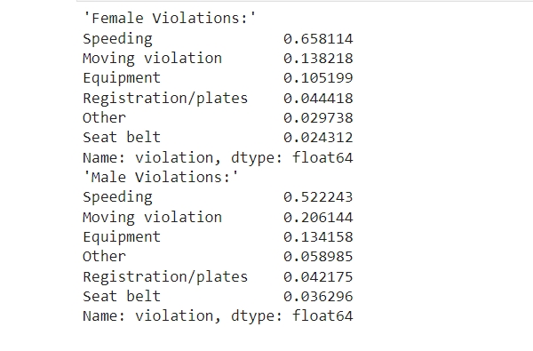
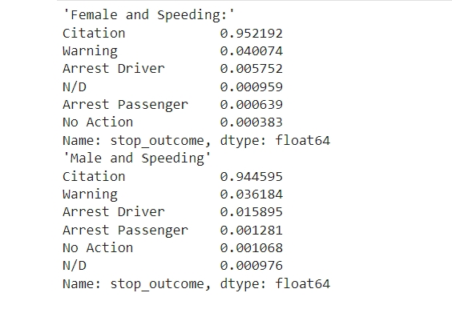
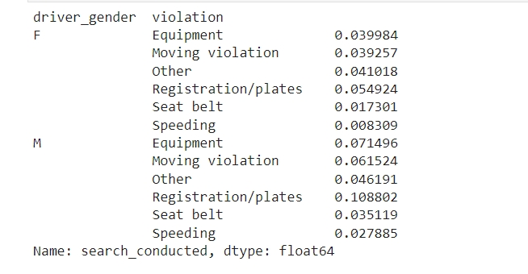
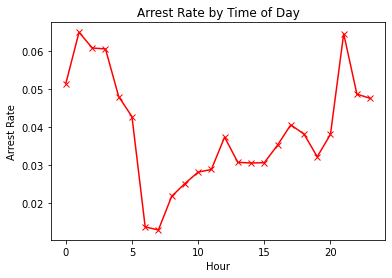
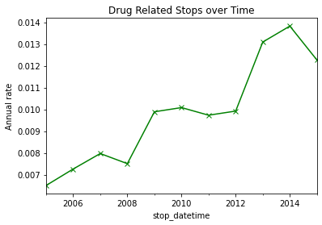

# Analyzing Police Activity
 An analysis for Rhode Island state traffic stops data and police interactions 

## Table of Contents

* [Motivation](#motivation)
* [In this notebook I explored these questions](#in-this-notebook-i-explored-these-questions)
* [Results](#results)
* [Required Packages](#required-packages)
* [Acknowledgements](#acknowledgements)
* [Future Scope](#future-scope)

## Motivation

Study the policing interactions with different people at traffic stops.

## In this notebook I explored these questions

- Do the gender commit different violations?
- Does gender affect who gets a ticket for speeding?
- Does gender affect whose vehicle is searched?
- Does time of the day affect arrest rate?
- Are drug-related stops on the rise?
- what violations are caught in each district?
- How long might you be stopped for a violation?

## Results

* Two thirds of female traffic stops are for speeding, whereas stops of males are more balanced across the six violations categories

* No, the gender does not affect

* Yes, As for all types of violations, the search rate is higher for males than for females

* Yes, the frisk rate for males is higher than for females.
* Yes, the arrest rate has a significant spike overnight, and dips in the early morning hours

* Yes, the rate of drug-stops nearly doubled over the course of 10 years

* It depends on the zone, but for majority of zones, the violations caught are similar.
* It depends of each type of violation, but on average it's between 10 to 20 minutes.

## Required Packages

* Python 3
* numpy
* pandas
* matplotlib
* seaborn

## Acknowledgements

* This project was done as a part of DataCamp's Data Analyst Career Track.
* The data used for this project was also downloaded from datacamp. I uploaded it with the project files. 

## Future Scope

* Investigate weather effect on policing interactions
* Explore race effect on arrest rate
